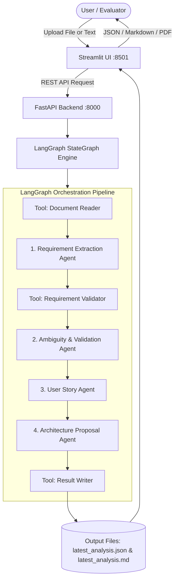
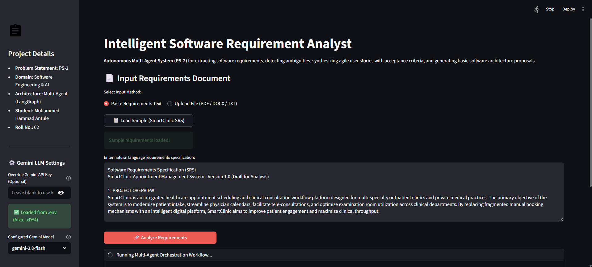
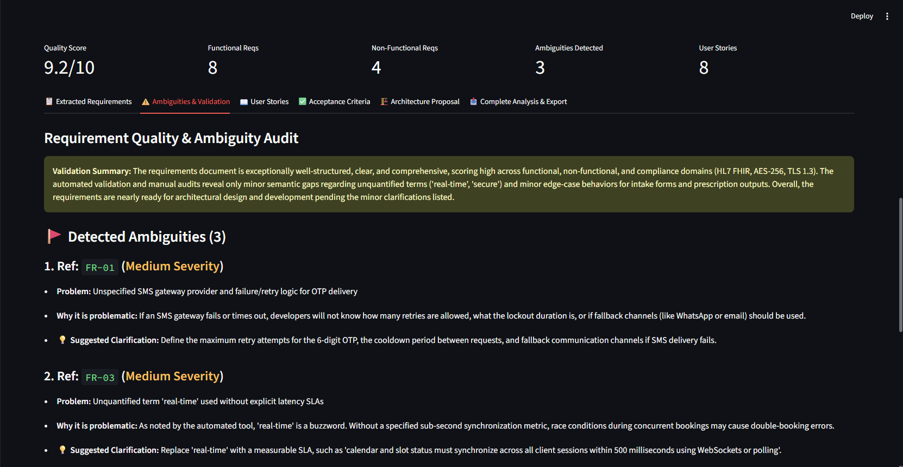
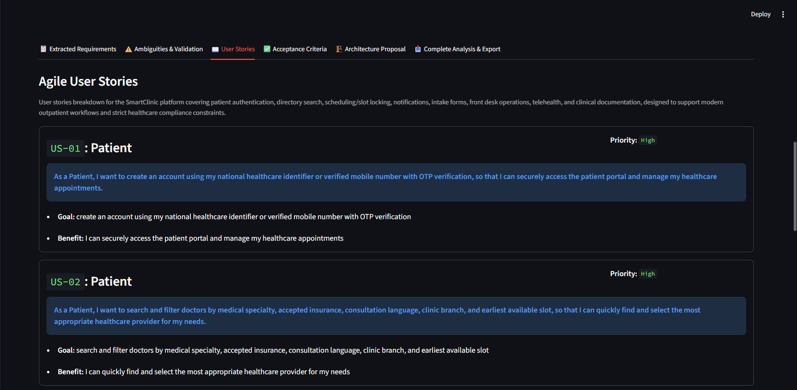
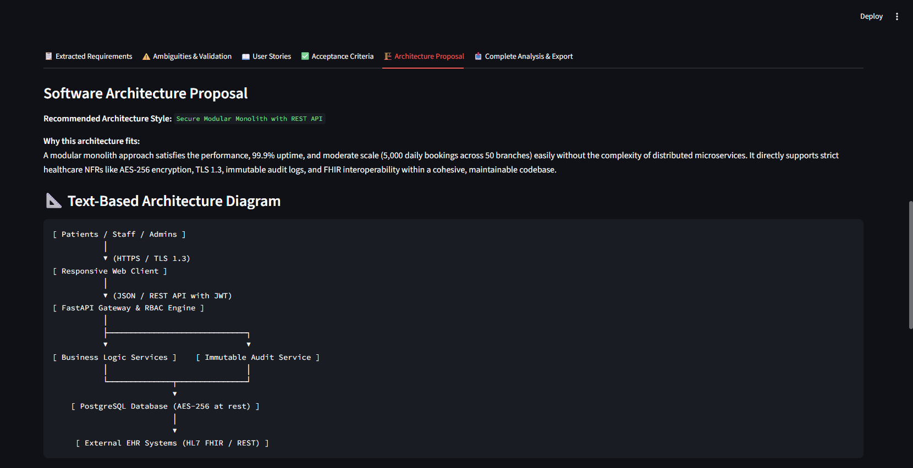
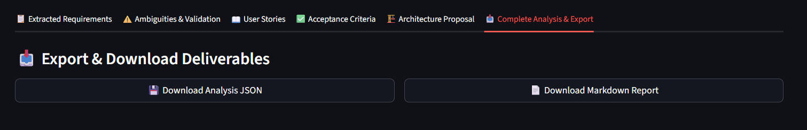

# Intelligent Software Requirement Analyst
### Autonomous Multi-Agent AI System for Software Requirements Engineering

[](https://www.python.org/)
[](https://github.com/langchain-ai/langgraph)
[](https://ai.google.dev/)
[](https://ai.google.dev/)
[](https://fastapi.tiangolo.com/)
[](https://streamlit.io/)


---

## Project Overview

The **Intelligent Software Requirement Analyst** is an autonomous multi-agent software engineering assistant designed to transform messy, ambiguous natural-language requirements into structured, developer-ready software specifications.

In standard software projects, flawed, missing, or contradictory requirements are widely recognized as a leading cause of project delays, budget overruns, and rework. Non-technical stakeholders often write requirements that contain vague buzzwords (*"the system must be fast and user-friendly"*), unquantified constraints, and missing business logic.

This application solves that problem by orchestrating **4 specialized autonomous agents** and **3 integrated tools** within a formal **LangGraph** sequential state machine:
1. **User Input:** The analyst or stakeholder provides natural language text directly or uploads a document (`.txt`, `.docx`, or `.pdf`).
2. **Autonomous Processing:** Agents extract functional and non-functional requirements, run deterministic heuristic checks for buzzwords and gaps, resolve ambiguities, author agile user stories with BDD (Given/When/Then) acceptance criteria, and propose an initial software architecture.
3. **Multi-Format Deliverables:** The system immediately outputs persistent machine-readable **JSON**, publication-ready **Markdown**, and an interactive, downloadable human-readable **PDF Report**.

---

## Project Details

- **Student Name:** Mohammed Hammad Antule
- **Roll Number:** 02
- **Course:** CE509 — Agentic AI / Computer DLOC Lab-I
- **Problem Statement No.:** PS-2
- **Domain:** Software Engineering & Development
- **Project Title:** Intelligent Software Requirement Analyst

---

## Problem Statement

> **Problem Statement No.: PS-2**  
> *"Agents extract requirements from natural language documents, resolve ambiguities, generate user stories, acceptance criteria, and a basic architecture proposal."*

Requirements engineering serves as the foundational bedrock of any successful software engineering initiative. When requirements are vague, inconsistent, or unquantified, downstream engineering teams suffer from miscommunication, architectural misalignment, and scope creep. 

Traditional natural language processing tools perform basic entity extraction but fail to reason about architectural implications, testability, or conflicting business rules. This project demonstrates how an agentic multi-agent architecture—combining deterministic rule validation with state-of-the-art Google Gemini Large Language Models—can autonomously elevate raw statements into comprehensive software engineering artifacts.

---

## Key Features

1. **Multi-Format Document Ingestion:**
   - Ingests unstructured requirements from plain text (`.txt`), Microsoft Word (`.docx`), and Adobe PDF (`.pdf`) documents, as well as direct clipboard/form input.
2. **Four Specialized Autonomous Agents:**
   - Requirement Extraction Agent, Ambiguity & Validation Agent, User Story Agent, and Architecture Proposal Agent.
3. **Three Integrated Tools:**
   - Document Reader Tool, Deterministic Requirement Validation Tool, and Result Writer Tool.
4. **LangGraph State Orchestration:**
   - Deterministic sequential execution governed by a typed shared state (`AnalystState`).
5. **High-Reliability Gemini Model Architecture:**
   - Primary model: `gemini-3.8-flash`.
   - Fallback model: `gemini-3.5-flash-lite`.
6. **Zero-Latency Fallback Handling:**
   - Immediate workflow-level switch to fallback on HTTP `429 RESOURCE_EXHAUSTED` or HTTP `503 SERVICE_UNAVAILABLE` without retry delays.
7. **Document Extraction Caching:**
   - File uploads in Streamlit are hashed and parsed once, preventing redundant file re-reads during user interactions.
8. **Interactive Streamlit Dashboard:**
   - Real-time agent status tracker, live metric scorecards, and 6 dedicated tabs for reviewing analysis findings.
9. **FastAPI REST Backend:**
   - Production-grade RESTful API endpoints for text analysis, document uploads, and health monitoring.
10. **Structured JSON Output:**
    - Full schema-validated output matching Pydantic models, persisted to `output/latest_analysis.json`.
11. **Formatted Markdown Report:**
    - Documentation-grade Markdown report persisted to `output/latest_analysis.md`.
12. **Human-Readable PDF Report Download:**
    - Clean, professional A4 PDF report generated on demand with formatted tables, badges, and page numbering.
13. **Comprehensive Automated Test Suite:**
    - 40 automated pytest unit and integration tests passing in ~1.24 seconds.

---

## How the System Works

The workflow moves sequentially through dedicated nodes, updating the centralized `AnalystState` at each milestone:

```
[ Natural Language Document / Text ]
                 │
                 ▼
     [ Tool: Document Reader ] ────────── Parses & normalizes text (.pdf, .docx, .txt)
                 │
                 ▼
  [ Agent 1: Requirement Extraction ] ── Extracts goals, actors, FRs, NFRs, rules, entities
                 │
                 ▼
  [ Tool: Requirement Validator ] ───── Scans buzzwords, missing fields, calculates score
                 │
                 ▼
  [ Agent 2: Ambiguity & Validation ] ── Flags ambiguities, conflicts, and gaps
                 │
                 ▼
  [ Agent 3: Agile User Stories ] ────── Formulates User Stories & BDD Acceptance Criteria
                 │
                 ▼
  [ Agent 4: Architecture Proposal ] ── Recommends style, components, databases, diagrams
                 │
                 ▼
     [ Tool: Result Writer ] ────────── Persists latest_analysis.json & latest_analysis.md
                 │
                 ▼
      [ Deliverable Downloads ] ─────── JSON  |  Markdown  |  Human-Readable PDF
```

---

## Multi-Agent Architecture

The 4 autonomous agents have strictly decoupled responsibilities. Each agent focuses on a single core aspect of requirements engineering:

| Agent | Responsibility | Core Output Schema |
|---|---|---|
| **1. Requirement Extraction Agent** | Ingests cleaned raw text; identifies high-level system goals, user actors, functional requirements (FRs), non-functional requirements (NFRs), business rules, constraints, and domain data entities. | `ExtractedRequirements` |
| **2. Ambiguity & Validation Agent** | Audits extracted requirements against quality standards; identifies vague wording, missing constraints, conflicting statements, and unquantified metrics. Executes the deterministic validation tool. | `ValidationResult` |
| **3. User Story Agent** | Converts validated requirements into standard agile user stories (`As a <role>, I want <goal>, so that <benefit>`) paired with BDD Given/When/Then acceptance criteria. | `UserStoriesResult` |
| **4. Architecture Proposal Agent** | Synthesizes functional and non-functional requirements to recommend software architecture styles (Modular Monolith, Microservices, Event-Driven), component layers, database technologies, authentication patterns, and an ASCII communication diagram. | `ArchitectureProposal` |

### System Flow Diagram (Mermaid)



---

## Integrated Tools & Utilities

### 1. Document Reader Tool (`app/tools/document_reader.py`)
- Reads raw binary streams or disk files across `.txt`, `.docx`, and `.pdf` formats.
- Extracts text cleanly using `pypdf` for PDF documents and `python-docx` for Word documents.
- Normalizes excess whitespace, strips non-printable control characters, and handles Unicode encoding gracefully.

### 2. Requirement Validator Tool (`app/tools/requirement_validator.py`)
- Implements deterministic rule-based checks inspired by IEEE 830 and ISO/IEC/IEEE 29148 standards.
- Detects unquantified buzzwords (`fast`, `scalable`, `user-friendly`, `real-time`, `100% secure`, `robust`) that lack measurable test metrics.
- Computes an automated heuristic quality score out of 10.0 based on requirement completeness and clarity.

### 3. Result Writer Tool (`app/tools/result_writer.py`)
- Automatically formats and saves the final analysis into two persistent deliverables in the `output/` directory:
  - `output/latest_analysis.json` — Raw structured JSON matching `FinalAnalysisResult`.
  - `output/latest_analysis.md` — Formatted technical Markdown documentation report.
- Overwrites previous files cleanly on each run to prevent directory clutter.

### 4. Isolated PDF Report Generator (`app/tools/pdf_generator.py`)
- Dedicated export utility powered by `reportlab`.
- Converts the completed `FinalAnalysisResult` into an A4 PDF document for non-technical stakeholders.
- Employs dynamic two-pass page numbering (`NumberedCanvas`), formatted tables for FRs/NFRs/Components, callout boxes for user stories, and XML entity escaping.
- Fully decoupled from agent execution: if PDF rendering fails, JSON/Markdown downloads and the core workflow remain unaffected.

---

## Gemini Model Configuration & Fallback Architecture

The system utilizes Google's official `google-genai` SDK with a resilient multi-tier fallback architecture:

- **Primary Model:** `gemini-3.8-flash`
  - Ultra-low latency, modern reasoning capabilities, and native JSON mode.
- **Fallback Model:** `gemini-3.5-flash-lite`
  - High availability fallback model activated whenever the primary model is constrained.

### Immediate Workflow-Level Fallback Logic

```
               [ Incoming Agent Request ]
                           │
                           ▼
          [ Call Primary: gemini-3.8-flash ]
                           │
         ┌─────────────────┴─────────────────┐
         │                                   │
      Success?                            Failed?
         │                                   │
         ▼                                   ▼
    [ Return JSON ]              What type of error?
                                 ┌───────────┴───────────┐
                                 │                       │
                     [ 429 Quota Exceeded ]    [ 503 / High Demand ]
                     "RESOURCE_EXHAUSTED"     "SERVICE_UNAVAILABLE"
                                 │                       │
                        NO primary retries       NO primary retries
                        (Immediate Fallback)     (Immediate Fallback)
                                 │                       │
                                 └───────────┬───────────┘
                                             │
                                             ▼
                              [ Immediately Activate Fallback Model ]
                                    gemini-3.5-flash-lite
                                             │
                                     Continues Workflow
                                 (Notice: "⚠️ Primary Gemini
                                 model unavailable. Using
                                     fallback model.")
                                             │
                              All remaining agents in workflow
                              directly use gemini-3.5-flash-lite
```

1. **HTTP 429 (`RESOURCE_EXHAUSTED`):**
   - The primary model is immediately marked unavailable for the remainder of the session/workflow.
   - Fallback to `gemini-3.5-flash-lite` occurs instantly with **zero retries**.
2. **HTTP 503 (`SERVICE_UNAVAILABLE`):**
   - Transient service spikes trigger an **immediate switch** to `gemini-3.5-flash-lite`.
   - The system avoids standard 5s, 10s, and 20s backoff delays, eliminating 35+ seconds of latency per call.
3. **Subsequent Agent Bypass:**
   - Once fallback is activated by any agent (e.g., Agent 1), all subsequent agents (Agents 2, 3, 4) directly invoke `gemini-3.5-flash-lite` without attempting the primary model.
4. **Permanent Errors (400, 401, 403, 404):**
   - Invalid API keys, authentication errors, or nonexistent models fail immediately with clear error diagnostics without retrying or masking errors.

---

## Input Formats

The application accepts requirements input through multiple channels:

1. **Direct Text Entry:** Paste raw requirement text directly into the Streamlit web interface or send it via the FastAPI JSON endpoint.
2. **Plain Text Files (`.txt`):** Standard UTF-8 encoded text files.
3. **Microsoft Word Documents (`.docx`):** Formatted Word files parsed via `python-docx`.
4. **Adobe PDF Documents (`.pdf`):** Multi-page PDF documents parsed via `pypdf`.

### Sample Requirements Dataset (`sample_data/`)
The repository includes a comprehensive sample dataset modeling the **"SmartClinic Appointment Management System"** across all three file formats:
- `sample_data/sample_requirements.txt`
- `sample_data/sample_requirements.docx`
- `sample_data/sample_requirements.pdf`

Each sample file contains:
- Executive Summary and Project Objectives.
- System Actors (Patient, Physician, Receptionist, System Administrator).
- Functional Requirements (FR-01 to FR-08).
- Intentionally ambiguous requirement statements (AMB-01 to AMB-04) designed to test the ambiguity auditing engine.
- Non-functional requirements (encryption, uptime, latency targets).
- Business rules and architectural constraints.

---

## Outputs & Deliverables

The application generates three distinct deliverable formats upon workflow completion:

### 1. Persistent JSON Report (`output/latest_analysis.json`)
- Machine-readable, structured data payload matching `FinalAnalysisResult`.
- Overwritten automatically on each successful workflow execution.
- Ideal for downstream automated pipelines and API consumers.

### 2. Persistent Markdown Report (`output/latest_analysis.md`)
- Technical documentation report complete with markdown tables, BDD scenarios, and ASCII architecture diagrams.
- Overwritten automatically on each successful workflow execution.
- Ideal for developer documentation, GitHub wikis, and PR attachments.

### 3. Human-Readable PDF Report (Interactive Download)
- Formatted A4 PDF report generated on demand directly from the Streamlit interface (`📄 Download PDF Report`).
- Features executive metadata tables, priority badges, structured requirement tables, BDD acceptance scenario callouts, and clean page numbering.
- Designed specifically for non-technical clients, faculty evaluators, and executive stakeholders.

---

## Streamlit Dashboard

The user interface (`frontend/streamlit_app.py`) provides an interactive multi-agent dashboard:

- **Sidebar Information:**
  - Displays project metadata:
    - **Problem Statement:** PS-2
    - **Domain:** Software Engineering & AI
    - **Architecture:** Multi-Agent (LangGraph)
    - **Student:** Mohammed Hammad Antule
    - **Roll No.:** 02
  - Automatic detection and masked display of `GEMINI_API_KEY` from `.env`.
  - Manual key override input and model selection dropdown.
- **Input Controls:**
  - Tabbed input: direct text input or multi-format file uploader (`.pdf`, `.docx`, `.txt`).
  - **"📋 Load Sample (SmartClinic SRS)"** button for instant one-click demonstration.
- **Live Execution Tracker:**
  - Real-time step-by-step progress indicator showing the status of each agent and tool.
- **Six Result Explorer Tabs:**
  - **Tab 1: Extracted Requirements:** System goals, actors, functional requirements, and non-functional requirements.
  - **Tab 2: Ambiguities & Validation:** Identified ambiguities, missing information, conflicting requirements, and deterministic tool findings.
  - **Tab 3: User Stories:** Agile user stories formatted as `As a... I want... so that...`.
  - **Tab 4: Acceptance Criteria:** Expandable BDD Given/When/Then scenarios.
  - **Tab 5: Architecture Proposal:** Recommended architecture style, component breakdown, database choices, security recommendations, and ASCII diagram.
  - **Tab 6: Export & Download Deliverables:** One-click download buttons for **JSON**, **Markdown**, and **PDF** reports, with a live markdown preview.

---

## Example Input and Output

### Input Example
```text
The system shall allow patients to book appointments with available physicians online.
The interface must be extremely fast and user-friendly.
Appointments can only be canceled up to 2 hours prior to the scheduled time.
```

### Representative Output Structure

```yaml
Extracted Requirements:
  FR-01: "Online Appointment Booking — System allows patients to select physician and slot"
  NFR-01: "Performance — Interface must be extremely fast" (Flagged for ambiguity)
  Business Rule: "Cancellations allowed up to 2 hours before appointment time"

Ambiguity & Validation Audit:
  Reference: "NFR-01"
  Problem: "Unquantified buzzword 'extremely fast' and 'user-friendly' lacks verifiable SLA"
  Suggested Clarification: "Define measurable target: e.g., page load under 1.5s, 95th percentile"

Agile User Story:
  ID: "US-01"
  Story: "As a Patient, I want to book appointments online, so that I avoid phone waiting time."
  Acceptance Criteria:
    AC-01:
      Given: "Patient is logged into the portal and views available physician slots"
      When: "Patient selects a slot and clicks confirm"
      Then: "Appointment is confirmed and confirmation notification is dispatched"

Architecture Proposal:
  Style: "Modular Monolith with REST API"
  Components:
    - Name: "Appointment Service" | Layer: "Backend" | Tech: "FastAPI"
    - Name: "Web Portal" | Layer: "Frontend" | Tech: "React / Streamlit"
  Database: "PostgreSQL with connection pooling"
  Authentication: "OAuth2 / JWT Token Authentication"
```

---

## Project Structure

```
Intelligent-Requirement-Analyst/
├── .env.example                 # Template for Gemini API key & port settings
├── .gitignore                   # Excludes .env, virtual environments, caches, and test artifacts
├── main.py                      # FastAPI REST application entry point
├── requirements.txt             # Project dependencies (FastAPI, LangGraph, Streamlit, etc.)
├── README.md                    # Project documentation & evaluator guide
│
├── app/                         # Core multi-agent application package
│   ├── config.py                # Environment configuration & API key detection
│   ├── agents/                  # Autonomous specialized LLM agents
│   │   ├── __init__.py          # Agent package exports
│   │   ├── requirement_agent.py # Agent 1: Functional & NFR extraction
│   │   ├── validation_agent.py  # Agent 2: Ambiguity detection & heuristic analysis
│   │   ├── user_story_agent.py  # Agent 3: Agile user stories & BDD criteria
│   │   ├── architecture_agent.py# Agent 4: Architecture proposal & ASCII diagrams
│   │   └── llm_util.py          # Gemini API utility, JSON cleaning & 429/503 fallback
│   ├── graph/                   # Multi-agent workflow orchestration
│   │   ├── __init__.py          # Graph exports
│   │   └── workflow.py          # LangGraph StateGraph, nodes, edges & state management
│   ├── models/                  # Data structures & validation
│   │   ├── __init__.py          # Schema exports
│   │   └── schemas.py           # Pydantic v2 schemas for agents and shared state
│   └── tools/                   # Integrated deterministic tools & export utilities
│       ├── __init__.py          # Tools package exports
│       ├── document_reader.py   # Tool 1: File parser (.pdf, .docx, .txt)
│       ├── requirement_validator.py # Tool 2: Deterministic buzzword & gap auditor
│       ├── result_writer.py     # Tool 3: Deliverable persistence (JSON & Markdown)
│       └── pdf_generator.py     # Isolated PDF report generation utility (ReportLab)
│
├── docs/                        # Project documentation & visual assets
│   └── screenshots/             # Interface demonstration screenshots
│
├── frontend/                    # Web presentation layer
│   └── streamlit_app.py         # Streamlit dashboard, student info, tabs & downloads
│
├── output/                      # Generated persistent deliverables
│   ├── latest_analysis.json     # Last completed analysis in JSON format
│   └── latest_analysis.md       # Last completed analysis in Markdown format
│
├── sample_data/                 # Evaluation dataset (SmartClinic SRS)
│   ├── sample_requirements.txt  # Plain text requirements document
│   ├── sample_requirements.docx # Microsoft Word requirements document
│   └── sample_requirements.pdf  # Adobe PDF requirements document
│
└── tests/                       # Automated test suite (40 tests)
    ├── test_api.py              # FastAPI endpoints & error validation tests
    ├── test_config.py           # Configuration, key masking & sidebar metadata tests
    ├── test_llm_util.py         # Model fallback, 429/503 bypass & JSON parsing tests
    ├── test_tools.py            # File readers, validator rules & PDF generator tests
    └── test_workflow.py         # LangGraph compilation & end-to-end execution tests
```

---

## Installation & Setup

### Prerequisites
- Python 3.11 or Python 3.12 installed on Windows, macOS, or Linux.
- A Google Gemini API key (obtainable at [Google AI Studio](https://aistudio.google.com/)).

### Step 1: Clone or Navigate to the Project
```bash
git clone <repository-url>
cd Intelligent-Requirement-Analyst
```

### Step 2: Create and Activate a Virtual Environment

**On Windows (PowerShell):**
```powershell
python -m venv .venv
.venv\Scripts\activate
```

**On Linux / macOS:**
```bash
python3 -m venv .venv
source .venv/bin/activate
```

### Step 3: Install Dependencies
```bash
pip install -r requirements.txt
```

### Step 4: Configure Environment Variables
Copy `.env.example` to create your local `.env` file:

**On Windows (PowerShell):**
```powershell
cp .env.example .env
```

**On Linux / macOS:**
```bash
cp .env.example .env
```

Open `.env` in a text editor and add your Gemini API key:
```env
# Google Gemini API Configuration
GEMINI_API_KEY=your_gemini_api_key_here
GEMINI_MODEL=gemini-3.8-flash
GEMINI_FALLBACK_MODEL=gemini-3.5-flash-lite

# Optional Server Configuration
PORT=8000
HOST=0.0.0.0
FASTAPI_BACKEND_URL=http://localhost:8000
```

> **Security Reminder:** Never commit the `.env` file or expose your API key. `.env` is ignored by git in `.gitignore`.

---

## Running the Application

For a complete demonstration, run both the FastAPI Backend and the Streamlit Frontend in two separate terminal windows:

### Terminal 1 — Start the FastAPI Backend
```powershell
python main.py
```
- Server URL: `http://localhost:8000`
- Swagger Interactive Documentation: `http://localhost:8000/docs`

### Terminal 2 — Start the Streamlit Frontend
```powershell
python -m streamlit run frontend/streamlit_app.py
```
- Dashboard URL: `http://localhost:8501`

*(Note: If Streamlit is launched without FastAPI running, the application seamlessly executes the LangGraph workflow in-process.)*

---

## Automated Testing

The project includes an automated test suite verifying every component without consuming live Gemini API quota:

```powershell
python -m pytest -v
```

### Test Suite Summary: **40 Tests Passed in ~1.24s**

```text
tests/test_api.py::test_health_check_endpoint PASSED                     [  2%]
tests/test_api.py::test_sample_requirements_endpoint PASSED              [  5%]
tests/test_api.py::test_text_analysis_short_text_rejection PASSED        [  7%]
tests/test_api.py::test_file_analysis_unsupported_extension PASSED       [ 10%]
tests/test_config.py::test_project_root_and_env_path PASSED              [ 12%]
tests/test_config.py::test_default_gemini_model_is_3_8_flash PASSED      [ 15%]
tests/test_config.py::test_default_gemini_fallback_model_is_3_5_flash_lite PASSED [ 17%]
tests/test_config.py::test_is_api_key_valid_detection PASSED             [ 20%]
tests/test_config.py::test_get_masked_api_key_never_exposes_secret PASSED [ 22%]
tests/test_config.py::test_masked_api_key_empty_or_placeholder PASSED    [ 25%]
tests/test_config.py::test_explicit_env_loading_independent_of_cwd PASSED [ 27%]
tests/test_config.py::test_sidebar_effective_key_resolution PASSED       [ 30%]
tests/test_config.py::test_sidebar_student_and_export_metadata PASSED    [ 32%]
tests/test_llm_util.py::test_clean_json_text_markdown_stripping PASSED   [ 35%]
tests/test_llm_util.py::test_is_quota_error_detection PASSED             [ 37%]
tests/test_llm_util.py::test_is_transient_503_error_detection PASSED     [ 40%]
tests/test_llm_util.py::test_primary_gemini_3_8_flash_success PASSED     [ 42%]
tests/test_llm_util.py::test_429_quota_immediately_triggers_fallback_without_retries PASSED [ 45%]
tests/test_llm_util.py::test_503_immediately_triggers_fallback_without_retries PASSED [ 47%]
tests/test_llm_util.py::test_subsequent_calls_directly_use_fallback_after_503 PASSED [ 50%]
tests/test_llm_util.py::test_case_3_agent_1_succeeds_agent_2_hits_503_and_subsequent_bypass PASSED [ 52%]
tests/test_llm_util.py::test_primary_and_fallback_both_failing PASSED    [ 55%]
tests/test_llm_util.py::test_permanent_error_without_retry_and_without_fallback PASSED [ 57%]
tests/test_llm_util.py::test_subsequent_calls_directly_use_fallback_after_429 PASSED [ 60%]
tests/test_tools.py::test_txt_document_reading PASSED                    [ 62%]
tests/test_tools.py::test_docx_document_reading PASSED                   [ 65%]
tests/test_tools.py::test_pdf_document_reading PASSED                    [ 67%]
tests/test_tools.py::test_read_sample_requirements_txt_from_disk PASSED  [ 70%]
tests/test_tools.py::test_read_sample_requirements_docx_from_disk PASSED [ 72%]
tests/test_tools.py::test_read_sample_requirements_pdf_from_disk PASSED  [ 75%]
tests/test_tools.py::test_empty_document_validation PASSED               [ 77%]
tests/test_tools.py::test_unsupported_file_extension PASSED              [ 80%]
tests/test_tools.py::test_clean_extracted_text PASSED                    [ 82%]
tests/test_tools.py::test_requirement_validator_detects_buzzwords PASSED [ 85%]
tests/test_result_writer_persistence_stable_filenames PASSED [ 87%]
tests/test_tools.py::test_pdf_report_generator_from_model PASSED         [ 90%]
tests/test_tools.py::test_pdf_report_generator_from_dict PASSED          [ 92%]
tests/test_workflow.py::test_graph_compilation_and_nodes PASSED          [ 95%]
tests/test_workflow.py::test_mocked_end_to_end_workflow PASSED           [ 97%]
tests/test_workflow.py::test_workflow_503_immediate_fallback PASSED      [100%]
============================= 40 passed in 1.24s ==============================
```

### Coverage Breakdown
- **FastAPI Endpoints (`tests/test_api.py`):** Health check, sample data dispatch, short text rejection, and invalid extension checks.
- **Configuration & Metadata (`tests/test_config.py`):** Environment loading, key masking security, default models, and sidebar metadata.
- **LLM Utility & Fallback (`tests/test_llm_util.py`):** Primary 200 OK execution, immediate 429 quota fallback, immediate 503 service unavailable fallback, subsequent agent bypass, and permanent 4xx handling.
- **Tools & PDF Generation (`tests/test_tools.py`):** TXT/DOCX/PDF parsing, buzzword detection heuristics, stable file overwriting, and PDF report byte generation.
- **LangGraph Workflow (`tests/test_workflow.py`):** StateGraph node compilation, sequential state transitions, mock end-to-end execution, and full workflow 503 fallback persistence.

---

## Security & API Key Protection

1. **Path-Anchored `.env` Loading:**
   - The application resolves the project root explicitly, ensuring `.env` is loaded regardless of the shell working directory.
2. **Masked Key Display:**
   - The Streamlit interface displays masked keys (e.g., `AIza...1234`), never printing secret tokens to logs or console output.
3. **Repository Cleanliness:**
   - `.gitignore` explicitly excludes `.env`, `__pycache__`, virtual environments (`.venv`), and local IDE files.

---

## Screenshots / Demo

### Main Dashboard & Input



### Requirements & Validation



### User Stories & Acceptance Criteria



### Architecture Proposal



### Downloadable Deliverables



---

## Limitations

- **Human-in-the-Loop Requirement:** While agents audit ambiguities and suggest clarifications, human domain experts should review requirements before engineering sign-off.
- **Basic Architecture Proposal:** The architectural proposal provides high-level guidance (components, communication flows, database styles); it does not replace low-level technical design documents (LLD).
- **External API Rate Limits:** Free-tier Gemini accounts operate under rate constraints. The application gracefully manages limits via fallback, but heavy workloads benefit from paid tier quotas.

---

## Academic / Viva Highlights (Q&A Cheat Sheet)

- **Q1: Why use LangGraph instead of a simple sequential Python script?**  
  *A:* LangGraph models the multi-agent workflow as a state machine with shared typed state (`AnalystState`). It provides a clear node-to-node flow and makes the agents easier to separate, test, and extend with conditional routing or human-in-the-loop steps.

- **Q2: How does the project fulfill the tool-calling requirement?**  
  *A:* The system integrates 3 functional tools:
  1. *Document Reader Tool:* Decodes and normalizes binary files (`.pdf`, `.docx`, `.txt`).
  2. *Requirement Validator Tool:* A deterministic rule engine that audits buzzwords and computes a quality score before LLM reasoning.
  3. *Result Writer Tool:* Persists analysis deliverables to disk.
  Additionally, an isolated *PDF Generator Utility* compiles the final analysis into printable documents.

- **Q3: Why combine deterministic validation with an LLM agent?**  
  *A:* The deterministic validator checks vague or unquantified terms such as fast, user-friendly, and scalable and produces a quality score. The LLM provides contextual reasoning about ambiguities, missing information, and business rules.

- **Q4: How does the model fallback mechanism work?**  
  *A:* The primary model is `gemini-3.8-flash`. If Google returns a `429 RESOURCE_EXHAUSTED` or `503 SERVICE_UNAVAILABLE` error, the system immediately switches to `gemini-3.5-flash-lite` without retry delays. Crucially, the fallback state persists across the workflow, allowing remaining agents to call the fallback model directly.

- **Q5: Why are the 4 agents separated instead of using a single large prompt?**  
  *A:* Prompt modularity reduces cognitive load on the LLM, eliminates token truncation issues, prevents role confusion, and enforces clean separation of concerns: extraction, quality auditing, agile mapping, and architectural synthesis.

---

## Technology Stack

- **Core Language:** Python 3.11 / Python 3.12
- **Agent Orchestration:** LangGraph (`langgraph>=0.2.0`)
- **LLM SDK:** Google GenAI SDK (`google-genai>=1.0.0`)
- **Language Models:** `gemini-3.8-flash` (Primary) & `gemini-3.5-flash-lite` (Fallback)
- **Web API Backend:** FastAPI (`fastapi>=0.110.0`) & Uvicorn (`uvicorn>=0.28.0`)
- **Interactive UI:** Streamlit (`streamlit>=1.32.0`)
- **Data Validation & Typing:** Pydantic v2 (`pydantic>=2.7.0`)
- **Document Processing:** `pypdf>=4.1.0` (PDFs) & `python-docx>=1.1.0` (Word)
- **PDF Report Generation:** ReportLab (`reportlab>=4.1.0`)
- **Environment Management:** `python-dotenv>=1.0.0`
- **Testing Framework:** Pytest (`pytest>=8.0.0`)

---

## Academic Notice

Developed as a college capstone project for **CE509 — Agentic AI / Computer DLOC Lab-I**, addressing **Problem Statement PS-2** (*Intelligent Software Requirement Analyst*).
